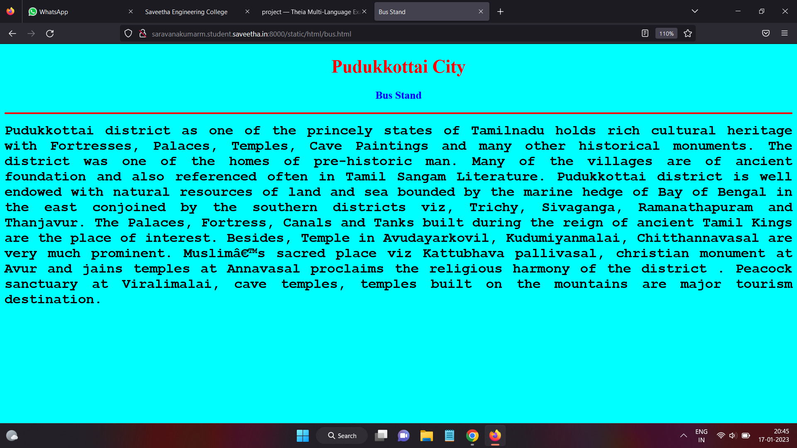
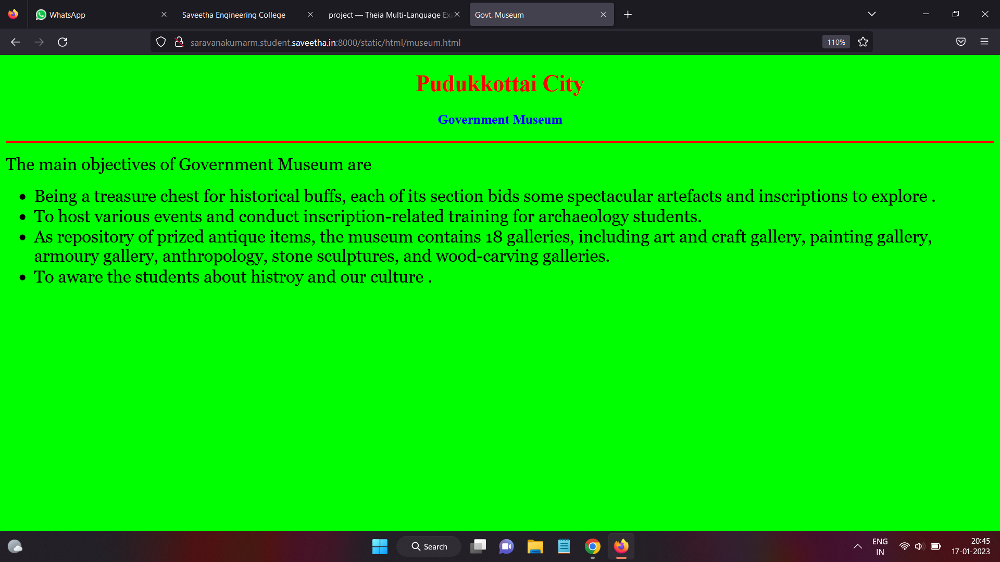
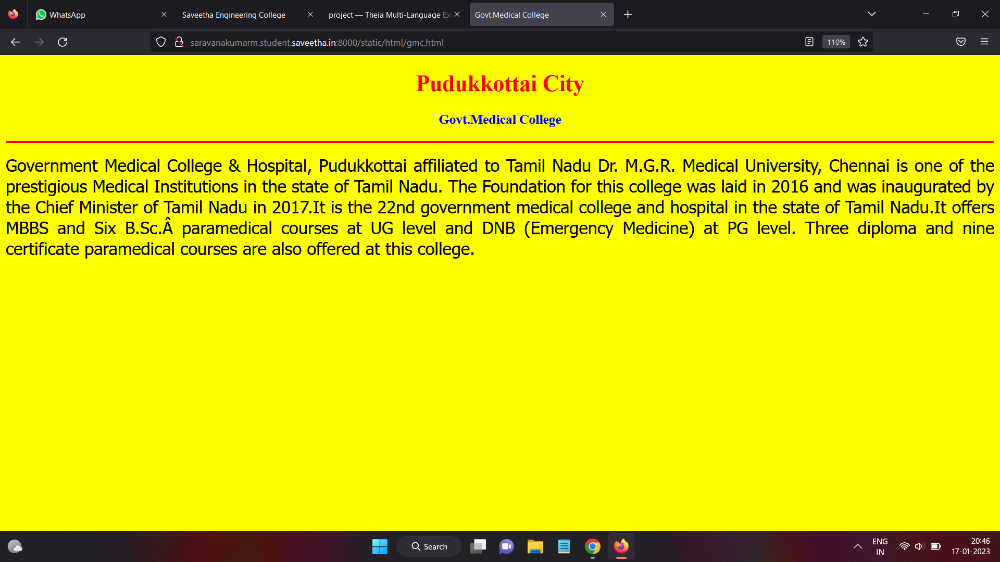
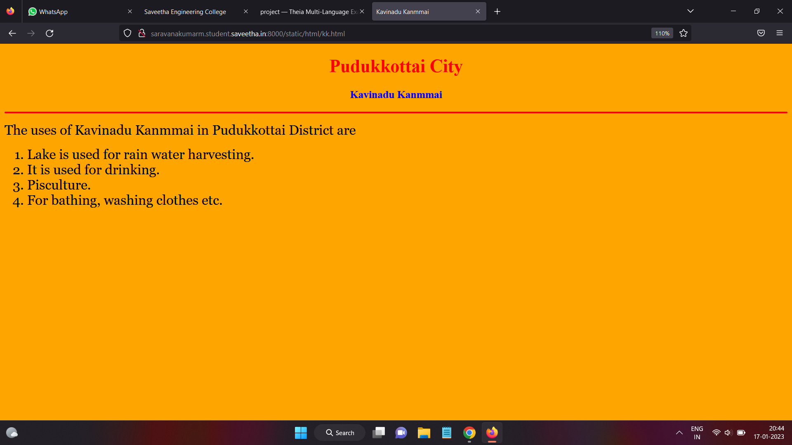
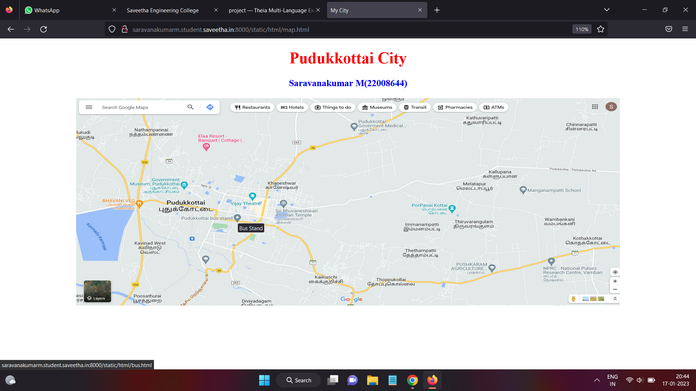
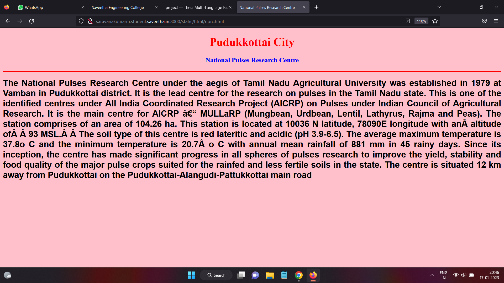

# Places Around Me
## AIM:
To develop a website to display details about the places around my house.

## Design Steps:

### Step 1:
Clone the github repository into Theia IDE

### Step 2:
Create a new Django project

### Step 3:
write the needed HTML code.

### Step 4:
Run the Django server and execute the HTML files.

## Code:
```
map.html
<!DOCTYPE html>
<html lang="en">
<head>
<title>My City</title>
</head>
<body>
<h1 align="center">
<font color="red"><b>Pudukkottai City</b></font>
</h1>
<h3 align="center">
<font color="blue"><b>Saravanakumar M(22008644)</b></font>
</h3>
<center>

<map name="MyCity">
<area shape="circle" coords="20,20,10" href="/static/html/gmc.html" title="Govt. Medical college">
<area shape="circle" coords="700,100,30" href="/static/html/nprc.html" title="National Pulses Research Centre">
<area shape="circle" coords="200,180,40" href="/static/html/museum.html" title="Govt. Museum">
<area shape="circle" coords="325,250,30" href="/static/html/bus.html" title="Bus Stand">
<area shape="rectangle" coords="170,250,1,1" href="/static/html/kk.html" title="Kavinadu Kanmmai">
</map>
</center>
</body>
</html>

bus.html
<!DOCTYPE html>
<html lang="en">
<head>
<title>Bus Stand</title>
</head>
<body bgcolor="cyan">
<h1 align="center">
<font color="red"><b>Pudukkottai City</b></font>
</h1>
<h3 align="center">
<font color="blue"><b>Bus Stand</b></font>
</h3>
<hr size="3" color="red">
<p align="justify">
<font face="Courier New" size="5">
<b>
Pudukkottai district as one of the princely states of Tamilnadu holds rich cultural heritage with Fortresses, Palaces, Temples, Cave Paintings and many other historical monuments. The district was one of the homes of pre-historic man. Many of the villages are of ancient foundation and also referenced often in Tamil Sangam Literature. Pudukkottai district is well endowed with natural resources of land and sea bounded by the marine hedge of Bay of Bengal in the east conjoined by the southern districts viz, Trichy, Sivaganga, Ramanathapuram and Thanjavur. The Palaces, Fortress, Canals and Tanks built during the reign of ancient Tamil Kings are the place of interest. Besides, Temple in Avudayarkovil, Kudumiyanmalai, Chitthannavasal are very much prominent. Muslim’s sacred place viz Kattubhava pallivasal, christian monument at Avur and jains temples at Annavasal proclaims the religious harmony of the district . Peacock sanctuary at Viralimalai, cave temples, temples built on the mountains are major tourism destination.
</b>
</font>
</p>
</body>
</html>

gmc.html
<!DOCTYPE html>
<html lang="en">
<head>
<title>Govt.Medical College</title>
</head>
<body bgcolor="yellow">
<h1 align="center">
<font color="red"><b>Pudukkottai City</b></font>
</h1>
<h3 align="center">
<font color="blue"><b>Govt.Medical College</b></font>
</h3>
<hr size="3" color="red">
<p align="justify">
<font face="Tahoma" size="5">
Government Medical College & Hospital, Pudukkottai affiliated to Tamil Nadu Dr. M.G.R. Medical University, Chennai  is one of the prestigious Medical Institutions in the state of Tamil Nadu. The Foundation for this college was laid in  2016 and was inaugurated by the Chief Minister of Tamil Nadu in 2017.It  is the 22nd government medical college and hospital in the state of Tamil Nadu.It offers MBBS and  Six B.Sc. paramedical courses at UG level and DNB (Emergency Medicine) at PG level. Three diploma  and nine certificate paramedical courses are also offered at this college.</font>
</p>
</body>
</html>

kk.html
<!DOCTYPE html>
<html lang="en">
<head>
<title>Kavinadu Kanmmai</title>
</head>
<body bgcolor="orange">
<h1 align="center">
<font color="red"><b>Pudukkottai City</b></font>
</h1>
<h3 align="center">
<font color="blue"><b>Kavinadu Kanmmai</b></font>
</h3>
<hr size="3" color="red">
<p align="justify">
<font face="Georgia" size="5">
The uses of Kavinadu Kanmmai in Pudukkottai District are 
<ol type="1">
<li>Lake is used for rain water harvesting.</li>
<li>It is used for drinking.</li>
<li>Pisculture.</li>
<li>For bathing, washing clothes etc.</li>
</ol>
</font>
</p>
</body>
</html>

museum.html
<!DOCTYPE html>
<html lang="en">
<head>
<title>Govt. Museum</title>
</head>
<body bgcolor="lime">
<h1 align="center">
<font color="red"><b>Pudukkottai City</b></font>
</h1>
<h3 align="center">
<font color="blue"><b>Government Museum</b></font>
</h3>
<hr size="3" color="red">
<p align="justify">
<font face="Georgia" size="5">
The main objectives of Government Museum are 
<ul>
<li>Being a treasure chest for historical buffs, each of its section bids some spectacular artefacts and inscriptions to explore .</li>
<li>To host various events and conduct inscription-related training for archaeology students.</li>
<li> As repository of prized antique items, the museum contains 18 galleries, including art and craft gallery, painting gallery, armoury gallery, anthropology, stone sculptures, and wood-carving galleries.</li>
<li>To aware the students about histroy and our culture .</li>
</ul>
</font>
</p>
</body>
</html>

nprc.html
<!DOCTYPE html>
<html lang="en">
<head>
<title>National Pulses Research Centre</title>
</head>
<body bgcolor="pink">
<h1 align="center">
<font color="red"><b>Pudukkottai City</b></font>
</h1>
<h3 align="center">
<font color="blue"><b>National Pulses Research Centre</b></font>
</h3>
<hr size="3" color="red">
<p align="justify">
<font face="Arial" size="5">
<b>
The National Pulses Research Centre under the aegis of Tamil Nadu Agricultural University was established in 1979 at Vamban in Pudukkottai district.  It is the lead centre for the research on pulses in the Tamil Nadu state.  This is one of the identified centres under All India Coordinated Research Project (AICRP) on Pulses under Indian Council of Agricultural Research. It is the main centre for AICRP – MULLaRP (Mungbean, Urdbean, Lentil, Lathyrus, Rajma and Peas).  The station comprises of an area of 104.26 ha.  This station is located at 10036 N  latitude,  78090E longitude with an altitude of  93 MSL.  The soil type of this centre is red lateritic and acidic (pH 3.9-6.5). The average maximum temperature is 37.8o C and the minimum temperature is 20.7 o C with annual mean rainfall of 881 mm in 45 rainy days.  Since its inception, the centre has made significant progress in all spheres of pulses research to improve the yield, stability and food quality of the major pulse crops suited for the rainfed and less fertile soils in the state.  The centre is situated 12 km away from Pudukkottai on the Pudukkottai-Alangudi-Pattukkottai main road</b>
</font>
</p>
</body>
</html>
```

## Output:












## HTML Validator


## Result:
The program for implementing image map is executed successfully  